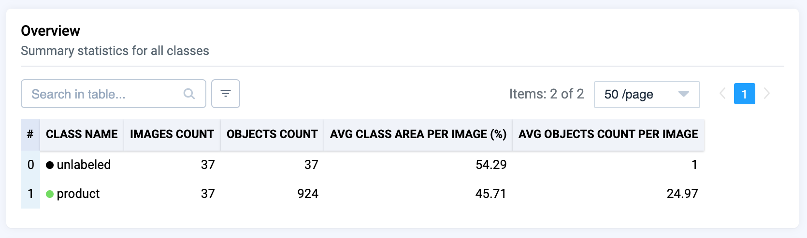
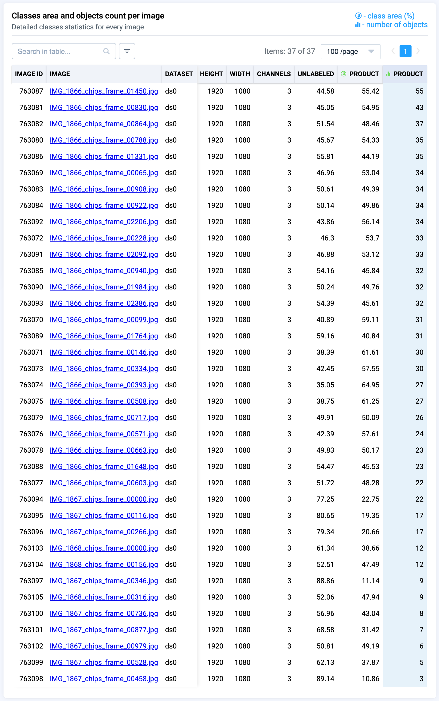
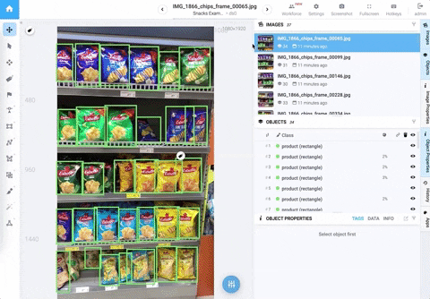

# Grocery Store Shelves

  <a href="#overview">Overview</a> •
  <a href="#overview">Statistics</a> •
  <a href="#data-rights">Examples</a>

 

## Overview 

Demo project with photos of grocery store shelves with snacks. Can be used for testing retail applications: manual products labeling, products detection, classification using catalogs, AI assisted classification and so on.

## Data Statistics

- Project consists of 37 images of grocery shelves
- All products ad labeled with rectangles (bounding boxes) of class `product`

## Examples

  
